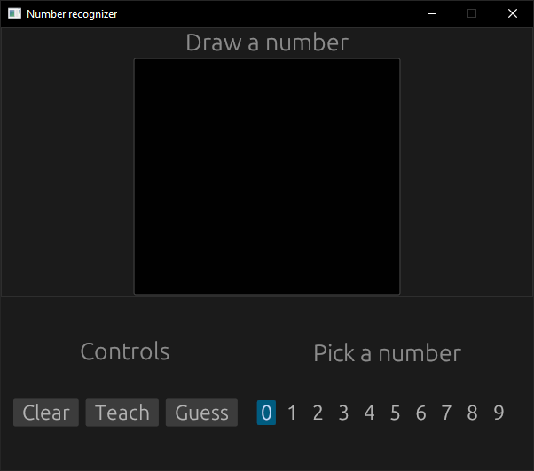

# SI - Rozpoznawanie Numerów



## Opis

Aplikacja, którą można nauczyć rozpoznawać odręcznie pisane cyfry od 0-9.

## Budowa z kodu źródłowego

```sh
git clone https://github.com/rosowskimik/ai-numery.git
cd ai-numery
cargo build --release
```
